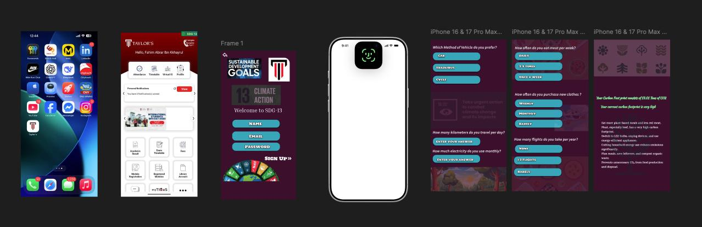
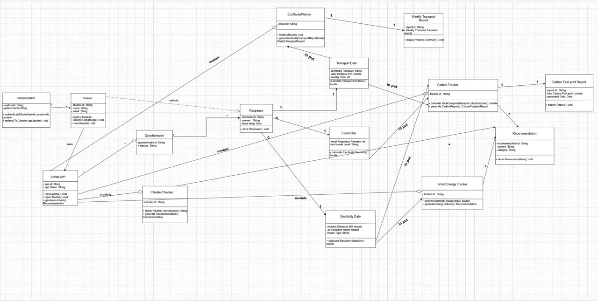
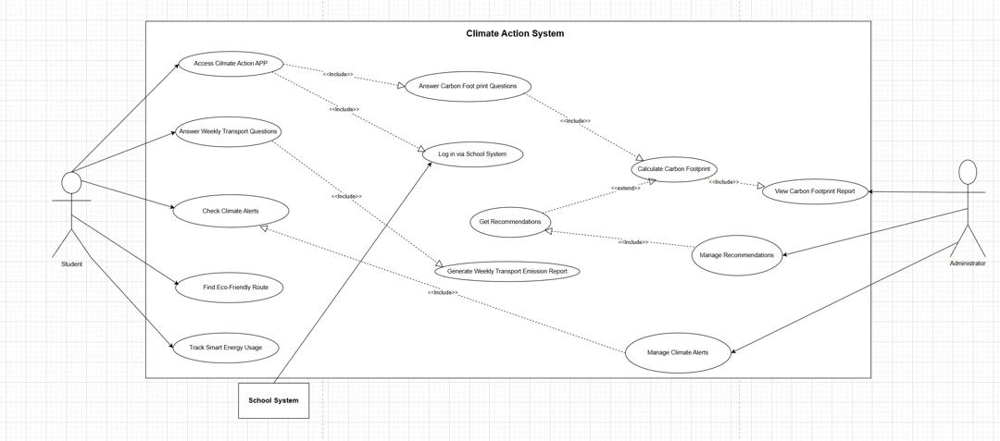

# Design Phase :

## Figma (overview-v1)
****

## UML Diagram
**[class1-drawio-UML-diagram (importable)](./diagrams/class1-drawio-UML-importable.xml)**
****

## Use Case Diagram
**[usecase-diagram-drawio (importable)](./diagrams/usecase-diagram-drawio-importable.xml)**
****
