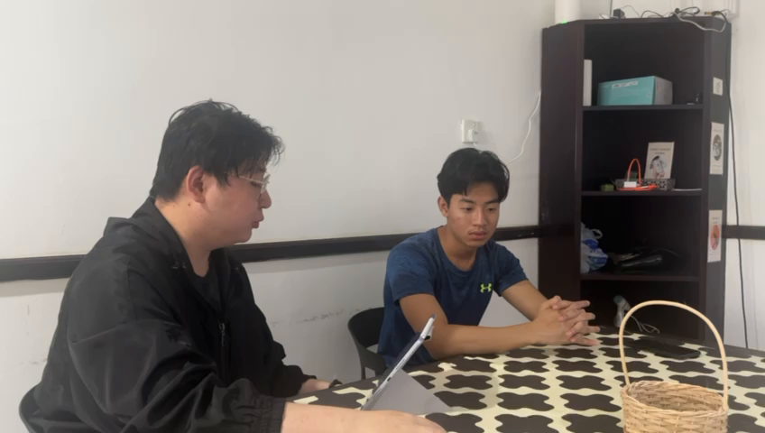

# Plan Phase

## user stories
- **user requirements & expectations**

## sprint notes
- **[sprint-notes](./sprint-notes/)**
- **progress, challenges, achievements**

## feedback
- **user feedback**

## information gathering (survey)
- **[FORM QUESTIONS](./FORMS-QUESTIONS.txt)**

## interview (video)
- **[WATCH INTERVIEW (video-interview.MOV)](./video-interview.MOV)**
****

## Github Screenshots (Progression)
- **[github-screenshot-23-02-2026-FEB](./github-screenshots/github-screenshot-23-02-2026-FEB.jpg)**
- **[github-screenshot-09-03-2026-MAR](./github-screenshots/github-screenshot-09-03-2026-MAR.jpg)**